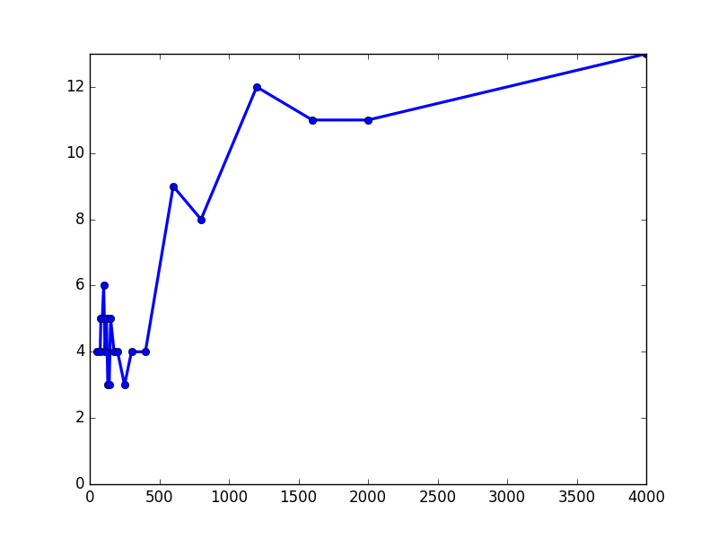

# Lista prática de exercícios

```
Autor: Vinícius Veloso de Mello Garcia
Matrícula: 2015662027
Disciplina: Aprendizado de Máquina 2016/1
Instituição: Universidade Federal de Minas Gerais - UFMG
```

# Introdução

Segue abaixo a resolução da lista de exercícios 1 disponibilizada no
[site da disciplina][1] pelo monitor Felipe Moraes e prof. Adriano Veloso.

Os exercícios abaixo foram realizados após realizar o download dos seguintes
arquivos de dados necessários:

1. `spam_test.txt`
2. `spam_train.txt`

## Exercício 1 (Train and validation sets):

Divida o arquivo `spam_train.txt` que contém 5000 linhas em dois arquivos:

1. `spam_train.txt` com as primeiras 4000 linhas do arquivo original.
2. `spam_validation.txt` com 1000 últimas linhas do arquivo original.

E então explique com suas palavras porque seria difícil avaliar a qualidade
dos classificadores que irei produzir neste exercício sem realizar essa
divisão previa dos dados de treino.

### Resposta:

A divisão dos dois arquivos foi realizada rapidamente utilizando a ferramenta `vim`.

O motivo pelo qual a avaliação se tornaria difícil é porque não haveriam dados disponíveis
para testar a generalização do meu algoritmo. Logo eu não poderia avaliar a presença ou
ausência do fenomeno de _overfitting_ em meus classificadores.

## Exercício 2 (Feature vectors):

Transforme todos os e-mails em `feature vectores`:

1. Encontre todas as palavras presentes nos e-mails de treino.
2. Forme o vocabulário com todas as palavras que aparecem e mmais de 30 e-mails.
3. Crie um _feature vector_ para cada e-mail, ou seja  
   Um vetor indexado segundo as palavras do vocabulário onde cada posição indica
   se a respectiva palavra está ou não presente no e-mail.

### Resposta:

Foi criado um script `ex2.py` para executar estas tarefas. Os arquivos produzidos
foram salvos no formato `JSON` nos seguintes arquivos:

- `ex2-vocabulary.json`
- `ex2-fvecs.json`

## Exercício 3 (Perceptron):

### Questão 3.1

Implemente as funções:

a. `perceptron_train(data)`

Essa função deve receber a tabela com os dados de
**treino** e suas respectivas classes.

Em sua execução ela deve repetir as atualizações dos pesos do
perceptron até que se obtenha 100% de acerto no treino.

Ela deve retornar:

- A contagem de atualizações individuais dos pesos.
- O número de iterações por toda a tabela (o número de eras)
- Os pesos finais calculados.

b. `perceptron_test(w_vec, data)`

Essa função deve receber:

- Os pesos calculados pela função `perceptron_train()`
- A tabela com os dados de **validação** e suas respectivas classes.

Ela deverá retornar a porcentagem de acertos no teste.

#### Resposta:

Foi implementado uma classe de nome `Perceptron`. Essa classe está contida
no arquivo `perceptron.py`. A classe contém:

- Um vetor de pesos `w_vec`
- A função `train(data)` que representa a função `perceptron_train(data)`
- A função `test(data)` que representa a função `perceptron_test(data)`

### Questão 3.2

Treine o seu perceptron com os dados de **treino** e então
responda:

- Quantos erros o algoritmo cometeu antes de convergir?
- Quantas iterações (eras) o algoritmo precisou para convergir?

Use a função teste em seu perceptron com os mesmos dados utilizados para
o **treino**, a função retornou 0% de erro como esperado?

Agora realize outro teste utilizando os dados de **validação**, qual a
porcentagem de erros cometidos pelo perceptron?

#### Resposta:

Para realizar essa atividade criou-se um script salvo com o nome: `ex3.2.py`

O script executou o perceptron que realizou um total de 664 erros
antes de convergir, e convergiu após um total de 13 eras.

Após o treinamento um teste foi realizado com a função `perceptron_test()`
com os mesmos dados utilizados no treino e encontrou uma porcentagem de
erros de 0% como esperado.

O teste final realizado com os dados de validação resultou em uma porcentagem
de erros aparentemente boa de apenas 2.7%.

### Questão 3.3

Para entender melhor o algoritmo, faça o um algoritmo para encontrar
as 15 palavras de maior peso e as 15 palavras de menor peso em seu perceptron.

Quais são estas palavras? Como interpretar o significado delas?

#### Resposta:

- As palavras de maior peso encontradas foram em ordem:

```json
[
  click,    remov, pleas,     pai, free,
  sight,       cb,    nb, present,  raw,
  guarante, death,   sir,    wait, hour
]
```

Estas palavras são as 15 palavras mais significativas
para identificar um SPAM, isso significa que a presença
de uma ou mais delas foi frequente em grande parte dos SPAMs.

- As palavras de menor peso encontradas foram em ordem:

```json
[
  there, still,  log, prefer, reserv,
   head,   not, view, author,   user,
  which,   rob,  but,  would,  wrote
]
```

Estas palavras são as 15 palavras mais significativas
para identificar um e-mail comum, isso significa que a
presença de uma ou mais delas foi frequente em grande
parte dos e-mails comuns.

### Questão 3.4

Faça uma série de experimentos variando o número de dados
fornecidos à função de treino de seu perceptron.

O professor sugere coletar amostras com
as seguintes quantidades de linhas nos dados de entrada:

```json
[ 100, 200, 400, 800, 2000, 4000 ]
```

Crie um gráfico mostrando o número de eras em função
da quantidade de dados.

#### Resposta:

Os experimentos foram realizados e o gráfico gerado
foi salvo sob o nome `ex3.4-plot.png`.

Utilizou-se os amostras propostas e mais várias outras,
com um total de 21 amostras diferentes para tornar a exibição
do gráfico mais interessante.

O grafico mostrou uma tendência geral à um maior número de eras
quanto maior o número de dados, porém essa relação mostrou-se
bastante instável principalmente com valores baixos.

O gráfico gerado segue abaixo:

: Gráfico Gerado



### Questão 3.5

Para evitar o _overfitting_ dos dados pode ser útil
ter um parametro para limitar o número máximo de iterações
do seu algoritmo durante a fase de treino.

Adicione à função `perceptron_train()` um parametro com esse
proposito.

#### Resposta:

Um parametro opcional de nome `max_ages` foi adicionado
a função `Perceptron.train()` do arquivo `perceptron.py`.

Ela foi testada e funciona corretamente.


