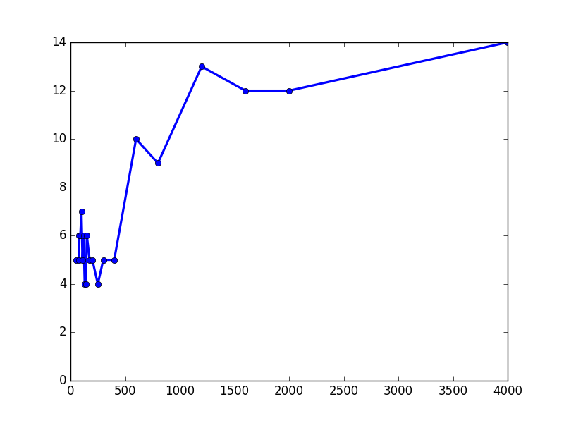

# Lista prática de exercícios

```
Autor: Vinícius Veloso de Mello Garcia
Matrícula: 2015662027
Disciplina: Aprendizado de Máquina 2016/1
Instituição: Universidade Federal de Minas Gerais - UFMG
```

# Introdução

Segue abaixo a resolução da lista de exercícios 1 disponibilizada no
[site da disciplina][1] pelo monitor Felipe Moraes e prof. Adriano Veloso.

Os exercícios abaixo foram realizados após realizar o download dos seguintes
arquivos de dados necessários:

1. [`spam_test.txt`][test]
2. [`spam_train.txt`][train]

[test]: spam_test.txt
[train]: spam_train.txt
[valid]: spam_validation.txt

## Exercício 1 (Train and validation sets):

Divida o arquivo [`spam_train.txt`][train]
que contém 5000 linhas em dois arquivos:

1. [`spam_train.txt`][train] com as primeiras 4000 linhas do arquivo original.
2. [`spam_validation.txt`][valid] com as 1000 últimas linhas do arquivo original.

E então explique com suas palavras porque seria difícil avaliar a qualidade
dos classificadores que irei produzir neste exercício sem realizar essa
divisão previa dos dados de treino.

### Resposta:

A divisão dos dois arquivos foi realizada rapidamente utilizando a ferramenta `vim`.

O motivo pelo qual a avaliação se tornaria difícil é porque não haveriam dados disponíveis
para testar a generalização do meu algoritmo. Logo eu não poderia avaliar a presença ou
ausência do fenomeno de _overfitting_ em meus classificadores.

## Exercício 2 (Feature vectors):

Transforme todos os e-mails em `feature vectores`:

1. Encontre todas as palavras presentes nos e-mails de treino.
2. Forme o vocabulário com todas as palavras que aparecem e mmais de 30 e-mails.
3. Crie um _feature vector_ para cada e-mail, ou seja  
   Um vetor indexado segundo as palavras do vocabulário onde cada posição indica
   se a respectiva palavra está ou não presente no e-mail.

### Resposta:

Foi criado um script [`ex2.py`](ex2.py) para executar estas tarefas. Os arquivos produzidos
foram salvos no formato `JSON` com os seguintes nomes:

- [`ex2-vocabulary.json`](ex2-vocabulary.json)
- [`ex2-train-vecs.json`](ex2-train-vecs.json)
- [`ex2-validation-vecs.json`](ex2-validation-vecs.json)

## Exercício 3 (Perceptron):

### Questão 3.1

Implemente as funções:

a. `perceptron_train(data)`

Essa função deve receber a tabela com os dados de
**treino** e suas respectivas classes.

Em sua execução ela deve repetir as atualizações dos pesos do
perceptron até que se obtenha 100% de acerto no treino.

Ela deve retornar:

- A contagem de atualizações individuais dos pesos.
- O número de iterações por toda a tabela (o número de épocas)
- Os pesos finais calculados.

b. `perceptron_test(w_vec, data)`

Essa função deve receber:

- Os pesos calculados pela função `perceptron_train()`
- A tabela com os dados de **validação** e suas respectivas classes.

Ela deverá retornar a porcentagem de acertos no teste.

#### Resposta:

Foi implementado uma classe de nome `Perceptron`. Essa classe está contida
no arquivo [`perceptron.py`](perceptron.py). A classe contém:

- Um vetor de pesos `w_vec`
- A função `train(data)` que representa a função `perceptron_train(data)`
- A função `test(data)` que representa a função `perceptron_test(data)`

### Questão 3.2

Treine o seu perceptron com os dados de **treino** e então
responda:

- Quantos erros o algoritmo cometeu antes de convergir?
- Quantas iterações (épocas) o algoritmo precisou para convergir?

Use a função teste em seu perceptron com os mesmos dados utilizados para
o **treino**, a função retornou 0% de erro como esperado?

Agora realize outro teste utilizando os dados de **validação**, qual a
porcentagem de erros cometidos pelo perceptron?

#### Resposta:

Para realizar essa atividade criou-se um script salvo com o nome: [`ex3.2.py`](ex3.2.py)

O script executou o perceptron que realizou um total de 664 erros
antes de convergir, e convergiu após um total de 13 épocas.

Após sua execução os vetor de pesos foi salvo no arquivo
[`ex3.2-w_vec.json`](ex3.2-w_vec.json)

Após o treinamento um teste foi realizado com a função `perceptron_test()`
com os mesmos dados utilizados no treino e encontrou uma porcentagem de
erros de 0% como esperado.

O teste final realizado com os dados de validação resultou em uma porcentagem
de erros aparentemente boa de apenas 2.7%.

### Questão 3.3

Para entender melhor o algoritmo, faça o um algoritmo para encontrar
as 15 palavras de maior peso e as 15 palavras de menor peso em seu perceptron.

Quais são estas palavras? Como interpretar o significado delas?

#### Resposta:

Foi produzido um script de nome [`ex3.3.py`](ex3.3.py) para extrair
estas palavras a partir dos pesos salvos no arquivo
[`ex3.2-w_vec.json`](ex3.2-w_vec.json).

- As palavras de maior peso encontradas foram em ordem:

```javascript
[
  "click",    "remov", "pleas",     "pai", "free",
  "sight",       "cb",    "nb", "present",  "raw",
  "guarante", "death",   "sir",    "wait", "hour"
]
```

Estas palavras são as 15 palavras mais significativas
para identificar um SPAM, isso significa que a presença
de uma ou mais delas foi frequente em grande parte dos SPAMs.

- As palavras de menor peso encontradas foram em ordem:

```javascript
[
  "there", "still",  "log", "prefer", "reserv",
   "head",   "not", "view", "author",   "user",
  "which",   "rob",  "but",  "would",  "wrote"
]
```

Estas palavras são as 15 palavras mais significativas
para identificar um e-mail comum, isso significa que a
presença de uma ou mais delas foi frequente em grande
parte dos e-mails comuns.

### Questão 3.4

Faça uma série de experimentos variando o número de dados
fornecidos à função de treino de seu perceptron.

O professor sugere coletar amostras com
as seguintes quantidades de linhas nos dados de entrada:

```javascript
[ 100, 200, 400, 800, 2000, 4000 ]
```

Crie um gráfico mostrando o número de épocas em função
da quantidade de dados.

#### Resposta:

Os experimentos foram realizados e o gráfico gerado
foi salvo sob o nome [`ex3.4-plot.png`](ex3.4-plot.png)
e exibido logo abaixo.

Utilizou-se as amostras propostas e mais várias outras,
com um total de 21 amostras diferentes para tornar a exibição
do gráfico mais interessante.

O gráfico gerado segue abaixo:



O gráfico mostrou uma correlação positiva entre o número
de épocas e a quantidade de dados, porém essa relação mostrou-se
bastante instável principalmente com valores baixos.

### Questão 3.5

Para evitar o _overfitting_ dos dados pode ser útil
ter um parametro para limitar o número máximo de iterações
do seu algoritmo durante a fase de treino.

Adicione à função `perceptron_train()` um parametro com esse
proposito.

#### Resposta:

Um parametro opcional de nome `max_epoch` foi adicionado
a função `Perceptron.train()` do arquivo [`perceptron.py`](perceptron.py).

Ela foi testada e funciona corretamente.

## Exercício 4 (SVM)

### Questão 4.1 e 4.2

Implemente a função de treino e teste do SVM seguindo
o algoritmo Pegasus.

O critério de parada do algoritmo deve ser um total
de 20 iterações (épocas). A função train deve também
calcular a função objetivo após cada iteração e salva-la
de forma que seus valores possam ser plotados posteriormente.

Após a implementação execute o treino com os dados de treino
e realize um plot com os resultados da função objetivo
para as 20 iterações. Nestes testes utilize 2**5 como lambda.

#### Resposta:

O algoritmo do SVM foi implementado segundo o pseud-código
do algoritmo Pegasus.

Para evitar duplicação de código a classe SVM ([`svm.py`](svm.py))
extende a classe utilizada na implementação do Perceptron ([`perceptron.py`](perceptron.py))
de forma que só foi necessário re-implementar a função de treino
e a função construtora.

O script responsável pelo instaciação da classe está contido no arquivo
[`ex4.1.py`](ex4.1.py) e o output do script foi salvo nos arquivos:

- [`4.1-w_vec.json`](4.1-w_vec.json)
- [`4.1-obj_vec.json`](4.1-obj_vec.json)

O plot foi realizado por um outro script de nome [`ex4.1.plot.py`](ex4.1.plot.py)
e salvo no arquivo [`ex4.1-plot.png`](ex4.1-plot.png) exibido abaixo.


Como esperado a função parece tender a decrescer e convergir para um valor
próximo de 0.

### Questão 4.3

Execute seu SVM para os valores de lambda
2**P variando P entre os valores:

- `[-9,-8,-7,-6,-5,-4,-3,-2,-1,0,1,2,3,4,5,6,7,8,9]`

Teste todos os resultados com os dados de teste e
validação, e encontre o P para o qual houve o menor
erro no teste de validação.

- Qual foi o valor de P deste classificador?

Para esse classificador então responda:

1. Qual foi o erro de treino?
2. Quantos das amostras de treino pertencem aos seus
   vetores de suporte?
3. Como você os encontrou?

Agora compare os resultados de seu teste com os resultados
de erro do perceptron. O que explica as diferenças?

#### Resposta:

O SVM foi executado para os valores requisitados de lambda
e os resultados obtidos foram salvos nos arquivos:

- [`ex4.2-w_vec-list.json`](ex4.2-w_vec-list.json)
- [`ex4.2-avg-train-err.json`](ex4.2-avg-train-err.json)
- [`ex4.2-avg-validation-err.json`](ex4.2-avg-validation-err.json)

Pode-se observar que o menor erro de validação ocorreu para
`P = (-5)`, ou seja `lambda=2**(-5)`, como pode ser
observado no gráfico abaixo:


Para esse valor de P o erro de treino foi `0.0132`. O que é 
interessante sobre esse resultado é que ele não foi o melhor
resultado dos testes de treino. 

Como pode ser observado no gráfico os testes de treino variaram
de forma que quanto menor P menos erros ele tendia a cometer
no treino, a mesma regra não foi seguida nos erros de validação que
apesar de também diminuirem entre os valores de `P=9` até `P=-5`,
eles voltam a aumentar após P assumir o valor -6.

Isso sugere que após esse ponto as melhoras no treino eram apenas
um caso de _overfitting_ e não representavam melhora real na solução.

**Support Vectors**:

Os pontos dos dados de treino que pertencem à vetores suporte foram
calculados pelo script [`ex4.2.support.py`](ex4.2.support.py).

O calculo foi realizado utilizando a equação:

```python
if Y*w_xi <= 1 + error:
  sup_vec_list.append(line_idx)
```

De forma que qualquer dado entre as duas margens foi considerado como
um vetor suporte. É no entanto esperado que após a convergência não
devam haver pontos entre as duas margens exceto devido a erros de cálculo
de ponto flutuante. Porém não foi isso que encontrei com cálculo acima.

Por algum motivo todos os pontos se encontravam no intervalo descrito acima
o que indica que deve haver algum erro no algoritmo.

Devido ao prazo não será possível corrigir este problema.

**Comparing with the Perceptron**:

Os resultados do SVM foram no melhor valor de lambda foram de 2% de erros
apenas, o que foi mais preciso do que os 2.7% de erros encontrados na
validação do Perceptron.

Isso é um bom indicativo pois sugere que apesar do erro descrito na obtenção
dos vetores suporte o SVM se comportou melhor que o perceptron, o que era o
resultado esperado.


